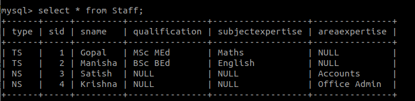
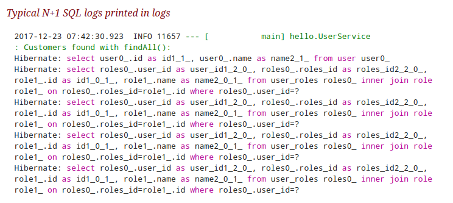
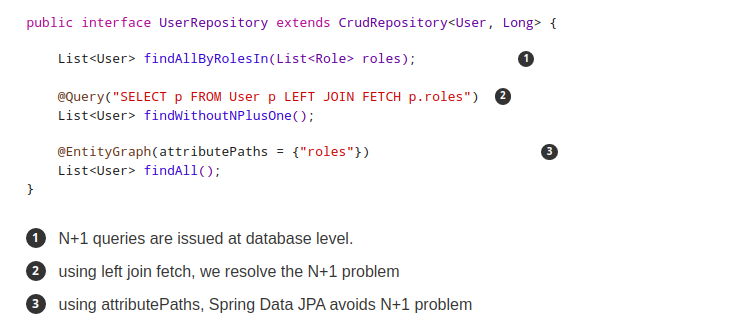

# JPA

# 1. JPA
Java Persistence API là tập các class và method để persistently store một số lượng lớn data xuống database được cung cấp bởi Oracle

Dùng JPA để giảm thiểu số lượng code để quản lý relational object, follow theo JPA Provider framework sẽ dễ dàng giao tiếp với database instance. 


## 1.1 Class level architecture


| Units                | Description                                                                                                      |
|----------------------|------------------------------------------------------------------------------------------------------------------|
| Entity               | Là các persistence object lưu dưới dạng record trong database                                                    |
| EntityManager        | Interface quản lí persistence operation trên object                                                              |
| EntityManagerFactory | factory class của EntityManager, tạo và quản lý multiple EntityManager instance                                  |
| EntityTransaction    | Quan hệ 1-1 với EntityManager. Với mỗi EntityManager, các operation sẽ được maintain bởi EntityTransaction class |
| Persistence          | Class này chỉ bao gồm các static method để chứa các EntityManagerFactory instance                                |
| Query                | Interface được implemented bởi mỗi JPA vendor để chứa các relational object đáp ứng các tiêu chí nào đó          |

Những class và interface trên dùng để lưu các entities xuống db dưới dạng 1 record, giúp giảm code để lưu data xuống db nên chỉ cần quan tâm đến những thứ quan trọng hơn như map các class với db table

## 1.2 JPA Class Relationships
Các quan hệ giữa class và interface nằm trong javax.persistence package


| Name                                   | Relationship | Description                                                        |
|----------------------------------------|--------------|--------------------------------------------------------------------|
| EntityManagerFactory and EntityManager | 1 - many     | 1 factory class cho các EntityManager instances                    |
| EntityManager and EntityTransaction    | 1 - 1        | Mỗi EntityTransaction instance ứng với mỗi EntityManager operation |
| EntityManager and Query                | 1 - many     | Nhiều query có thể được thực thi bởi 1 EntityManager instance.     |
| EntityManager and Entity               | 1 - many     | 1 EntityManager instance có thể quản lí nhiều Entities             |

## 1.3 Object relational mapping
ORM là 1 programming có khả năng convert data từ object type sang relational type và ngược lại. Main feature của ORM là mapping hoặc binding 1 object thành data trong db. 

### Advanced feature
- Idiomatic persistence: cho phép write persistence classes bằng cách dùng object oriented classes
- High Performance: nó có nhiều kỹ thuật fetching và lock
- Reliable: rất ổn định 

### ORM architecture


Theo kiến trúc trên, 1 object data được lưu xuống relational db theo 3 phases:

#### Phases 1
Object data phases bao gồm các POJO class, service, interface và các class. Là main business component layer, bao gồm business logic operations và attribute

Ví dụ: với employee db 
- Employee POJO class bao gồm các attribute như: id, name, salary,... Method gồm: setter getter,...
- Employee DAO/service class bao tồm các service method như: create employee, find employee ,...

#### Phases 2
Mapping hay persistence phases bao gồm JPA provider, mapping file ORM.xml, JPA Loader và Object Grid
- JPA Provider: 1 vendor product bao gồm JPA flavor(javax.persistence) vd như: Eclipselink, Toplink, Hibernate, etc.
- Mapping file: mapping file ORM.xml ao gồm mapping configuration giữa data trong POJO class với data trong relational db
- JPA Loader: JPA loader làm việc như 1 cache memory, có thể load relational grid data. Nó như 1 bản copy của db để tương tác với các service class của POJO data(attribute của POJO class)
- Object Grid: là 1 temporary location để lưu bản copy của relational data như 1 cache memory. Mọi câu quey tới db, đầu tiên đều ảnh hưởng tới data trong object grid trước, sau khi nó commit thì mới ảnh hưởng tới db chính

#### Phases 3
Relational data phases bao gồm relational data được logically connected tới business component. Như đã nói ở phases 2, chỉ khi business component commit data thì nó mới được lưu xuống db vật lý. Cho đến lúc đó data được lưu ở cache memory dưới dạng grid format. Quá trình lấy data

3 phases trên được gọi là object relational mapping

### Mapping.xml
mapping.xml file hướng dẫn JPA vendor mapping Entity class với database tables
Vd: employee enity:
```
public class Employee {

   private int eid;
   private String ename;
   private double salary;
   private String deg;

   public Employee(int eid, String ename, double salary, String deg) {
      super( );
      this.eid = eid;
      this.ename = ename;
      this.salary = salary;
      this.deg = deg;
   }

   public Employee( ) {
      super();
   }

   public int getEid( ) {
      return eid;
   }
   
   public void setEid(int eid) {
      this.eid = eid;
   }
   
   public String getEname( ) {
      return ename;
   }
   
   public void setEname(String ename) {
      this.ename = ename;
   }

   public double getSalary( ) {
      return salary;
   }
   
   public void setSalary(double salary) {
      this.salary = salary;
   }

   public String getDeg( ) {
      return deg;
   }
   
   public void setDeg(String deg) {
      this.deg = deg;
   }
}
```

mapping.xml

```
<? xml version="1.0" encoding="UTF-8" ?>

<entity-mappings xmlns="http://java.sun.com/xml/ns/persistence/orm"
   xmlns:xsi="http://www.w3.org/2001/XMLSchema-instance"
   xsi:schemaLocation="http://java.sun.com/xml/ns/persistence/orm    
   http://java.sun.com/xml/ns/persistence/orm_1_0.xsd"
   version="1.0">
      
   <description> XML Mapping file</description>
      
   <entity class="Employee">        
      <table name="EMPLOYEETABLE"/>
      <attributes>
      
         <id name="eid">
            <generated-value strategy="TABLE"/>
         </id>

         <basic name="ename">
            <column name="EMP_NAME" length="100"/>
         </basic>
         
         <basic name="salary">
         </basic>
         
         <basic name="deg">
         </basic>
         
      </attributes>
   </entity>
   
</entity-mappings>
```

- <entity-mappings>: tag define schema definition cho phép các tag entity trong xml file
- <description>: tag define description của application
- <entity>: tag define entity class mà cần convert thành table trong db. Attribute class define bời POJO entity class name
- <table>: tag define table name. Nếu muốn dùng class name làm table name thì không cần tag này
- <id>: tag define primary key của table. 
- <generated-value>: tag define primary key value là Automatic, Manual, or taken from Sequence.
- <basic>: tag dùng để define các attribute còn lại cho table
- <column-name>: tag dùng để define table field name mà người dùng định nghĩa

### Annotation

| Annotation         | Description                                                                                                                                                                                     |
|--------------------|-------------------------------------------------------------------------------------------------------------------------------------------------------------------------------------------------|
| @Entity            | This annotation specifies to declare the class as entity or a table.                                                                                                                            |
| @Table             | This annotation specifies to declare table name.                                                                                                                                                |
| @Basic             | This annotation specifies non constraint fields explicitly.                                                                                                                                     |
| @Embedded          | This annotation specifies the properties of class or an entity whose value instance of an embeddable class.                                                                                     |
| @Id                | This annotation specifies the property, use for identity (primary key of a table) of the class.                                                                                                 |
| @GeneratedValue    | This annotation specifies, how the identity attribute can be initialized such as Automatic, manual, or value taken from sequence table.                                                         |
| @Transient         | This annotation specifies the property which in not persistent i.e. the value is never stored into database.                                                                                    |
| @Column            | This annotation is used to specify column or attribute for persistence property.                                                                                                                |
| @SequenceGenerator | This annotation is used to define the value for the property which is specified in @GeneratedValue annotation. It creates a sequence.                                                           |
| @TableGenerator    | This annotation is used to specify the value generator for property specified in @GeneratedValue annotation. It creates a table for value generation.                                           |
| @AccessType        | This type of annotation is used to set the access type. If you set @AccessType(FIELD) then Field wise access will occur. If you set @AccessType(PROPERTY) then Property wise assess will occur. |
| @JoinColumn        | This annotation is used to specify an entity association or entity collection. This is used in many- to-one and one-to-many associations.                                                       |
| @UniqueConstraint  | This annotation is used to specify the field, unique constraint for primary or secondary table.                                                                                                 |
| @ColumnResult      | This annotation references the name of a column in the SQL query using select clause.                                                                                                           |
| @ManyToMany        | This annotation is used to define a many-to-many relationship between the join Tables.                                                                                                          |
| @ManyToOne         | This annotation is used to define a many-to-one relationship between the join Tables.                                                                                                           |
| @OneToMany         | This annotation is used to define a one-to-many relationship between the join Tables.                                                                                                           |
| @OneToOne          | This annotation is used to define a one-to-one relationship between the join Tables.                                                                                                            |
| @NamedQueries      | This annotation is used for specifying list of named queries.                                                                                                                                   |
| @NamedQuery        | This annotation is used for specifying a Query using static name.                                                                                                                               |
### Eager and lazy loading
Concept chính của JPA là tạo 1 cản duplicate copy của db trong cache memory, khi transaction diễn ra ở db, đầu tiên nó tác động đến duplication data trước và chỉ khi nó được commit bởi entity manager thì tất cả thay đổi mới được tác động xuống db

Có 2 cách fetching record từ db - eager fetch và lazy fetch
- Eager fetch: lấy tất cả record trong khi tìm record bằng primary key
- Lazy fetch: Kiểm tra xem primary key có tồn tại không. Sau đó khi call bất gì getter method nào của nó thì entity mới fetch toàn bộ. Lazy fetch khả thi khi bạn muốn fetch record ở lần đầu tiên. Với cách này, 1 bản copy của toàn bộ record được lưu sẵn trong cache memory. Lazy fetch cho performance tốt hơn

## 1.4 Inheritance strategies


### 1.4.1 Single table strategy
Single-table strategy lấy tất cả class field (cả super và sub class) và map chúng thành 1 single table. discriminator value có vai trò quan trọng trong việc phân biệt các value của 3 entity trong 1 table



### 1.4.2 Joined table strategy
Joined table strategy share referenced column bao gồm unique value để join table và tạo eassy transaction


### 1.4.3 Table per class strategy
Table per class strategy taoj 1 table cho mooix sub entity. Staff table cũng được create nhưng sẽ chứa null records. Các field value của Staff table phải được share cho TeachingStaff và NonTeachingStaff table

## 1.5 Entity relationship
- @ManyToOne Relation
  
- @OneToMany Relation
- @OneToOne Relation: mỗi row của 1 entity được referenced tới many child record của các entity khác. Các child record không được có multiple parent. Trong quan hệ one-to-many giữa table A và table B, mỗi row trong table A linked tới 0, 1, hoặc nhiều rows trong table B
- @OneToOne Relation: 
- @ManyToMany Relation:
  

## 1.6 JPQL
Java Persistence Query Language được define trong JPA specification, dùng để tạo các câu query entity để lưu xuống relational db. JPQL được phát triển dựa trên SQL syntax nhưng nó không tác động trực tiếp xuống db.

JPQL có thể lấy infor hoặc data dùng SELECT clause, thực hiện 1 lượng lớn update dùng UPDATE và DELETE clause

### Query structure
SQL làm việc trực tiếp với realational db tables, records, fields, trong khi JPQL làm việc với Java class và instance

Vd: 1 câu JPQL query có thể retrieve 1 entity object hơn là 1 field result set từ db.
JPQL query structure có dạng như sau:

```
SELECT ... FROM ...
[WHERE ...]
[GROUP BY ... [HAVING ...]]
[ORDER BY ...]
```

```
DELETE FROM ... [WHERE ...]
 
UPDATE ... SET ... [WHERE ...]
```

### Scalar and Aggregate functions
- Scalar function returns result values dựa vào input values
- Aggreagate function return result values bằng cách tính toán input value

```
package com.tutorialspoint.eclipselink.service;

import java.util.List;
import javax.persistence.EntityManager;
import javax.persistence.EntityManagerFactory;
import javax.persistence.Persistence;
import javax.persistence.Query;

public class ScalarandAggregateFunctions {
   public static void main( String[ ] args ) {
   
      EntityManagerFactory emfactory = Persistence.createEntityManagerFactory( "Eclipselink_JPA" );
      EntityManager entitymanager = emfactory.createEntityManager();

      //Scalar function
      Query query = entitymanager.
      createQuery("Select UPPER(e.ename) from Employee e");
      List<String> list = query.getResultList();

      for(String e:list) {
         System.out.println("Employee NAME :"+e);
      }
      
      //Aggregate function
      Query query1 = entitymanager.createQuery("Select MAX(e.salary) from Employee e");
      Double result = (Double) query1.getSingleResult();
      System.out.println("Max Employee Salary :" + result);
   }
}
```

### Between, and, like keywords
Dùng trong where clause

```
package com.tutorialspoint.eclipselink.service;

import java.util.List;
import javax.persistence.EntityManager;
import javax.persistence.EntityManagerFactory;
import javax.persistence.Persistence;
import javax.persistence.Query;
import com.tutorialspoint.eclipselink.entity.Employee;

public class BetweenAndLikeFunctions {
   public static void main( String[ ] args ) {
   
      EntityManagerFactory emfactory = Persistence.createEntityManagerFactory( "Eclipselink_JPA" );
      EntityManager entitymanager = emfactory.createEntityManager();
      
      //Between
      Query query = entitymanager.createQuery( "Select e " + "from Employee e " + "where e.salary " + "Between 30000 and 40000" );
      
      List<Employee> list=(List<Employee>)query.getResultList( );

      for( Employee e:list ){
         System.out.print("Employee ID :" + e.getEid( ));
         System.out.println("\t Employee salary :" + e.getSalary( ));
      }

      //Like
      Query query1 = entitymanager.createQuery("Select e " + "from Employee e " + "where e.ename LIKE 'M%'");
      
      List<Employee> list1=(List<Employee>)query1.getResultList( );
      
      for( Employee e:list1 ) {
         System.out.print("Employee ID :"+e.getEid( ));
         System.out.println("\t Employee name :"+e.getEname( ));
      }
   }
}
```

### Ordering

```
package com.tutorialspoint.eclipselink.service;

import java.util.List;
import javax.persistence.EntityManager;
import javax.persistence.EntityManagerFactory;
import javax.persistence.Persistence;
import javax.persistence.Query;
import com.tutorialspoint.eclipselink.entity.Employee;

public class Ordering {

   public static void main( String[ ] args ) {
      EntityManagerFactory emfactory = Persistence.createEntityManagerFactory( "Eclipselink_JPA" );
      EntityManager entitymanager = emfactory.createEntityManager();
      
      //Between
      Query query = entitymanager.createQuery( "Select e " + "from Employee e " + "ORDER BY e.ename ASC" );

      List<Employee> list = (List<Employee>)query.getResultList( );

      for( Employee e:list ) {
         System.out.print("Employee ID :" + e.getEid( ));
         System.out.println("\t Employee Name :" + e.getEname( ));
      }
   }
}
```

### Named queries
@NamedQuery annotation được defined như 1 câu query với 1 query string không thể thay đổi được xác định trước. Thay vì dynamic queries, sử dụng named queries có thể improve code organization bằng cách tách JPQL query string khỏi POJO. Nó cũng truyền các query parameter vào thay vì nhúng chữ vào query string và kết quả là các câu truy vấn sẽ hiệu quả hơn


## 1.7 Criteria API
Criteria API là 1 predefined API dùng để define các câu query cho các entity. Đây là 1 cách khác để define JPQL query. Các câu query này là type-safe, portable, dễ modify bằng cách thay đổi syntax. Giống với JPQL nó follow abstract schema (dễ dàng edit schema) và embedded object. 

Ưu điểm lớn nhất của criteria API và errors có thể được detected sớm hơn khi compile time. String based JPQL queries và JPA criteria based queries có cùng performance và hiệu quả

### Criteria Query Structure
Criteria API và JPQL có liên quan chặt chẽ với nhau và cho phép design bằng cách dùng các operator tương tự trong câu query của nó. Nó follow javax.persistence.criteria package để design câu query. Query structure nghĩa là syntax criteria query

Vd: criteria query đơn giản return tất cả instance của entity class trong data source

```
EntityManager em = ...;
CriteriaBuilder cb = em.getCriteriaBuilder();

CriteriaQuery<Entity class> cq = cb.createQuery(Entity.class);
Root<Entity> from = cq.from(Entity.class);

cq.select(Entity);
TypedQuery<Entity> q = em.createQuery(cq);
List<Entity> allitems = q.getResultList();
```

Query thể hiện các basic step để tạo criteria:
- `EntityManager` instance dùng để tạo `CriteriaBuilder` object
- `CriteriaQuery` instance dùng để tạo 1 query object, các attribute của query object này sẽ được modified với details của query
- `CriteriaQuery.from` method được gọi để set query root
- `CriteriaQuery.select` method được gọi để set result list type
- `TypedQuery<T>` instance dùng để chuẩn bị 1 câu query để execution và chỉ định type của query result
- `getResultList` method trên TypedQuery<T> object để execute câu query. Câu query này return 1 collection các enities dưới dạng 1 list

## 1.8 Entity object life cycle
Life cycle cuả entity object gồm 4 state: New, Managed, Removed, Detached


- New state: khi 1 entity được khởi tạo. State này object vẫn chưa liên kết với EntityManager và không có mặt trong db
- Managed: khi entity được persisted tới db bằng persis method của EntityManager's, nó phải được invoked bên trong 1 active transaction. Trong transaction commit, EntityManager lưu các entity object mới tới db. Entity object được retrieved từ db bởi EntityManager tất cả đều trong Managed state. Nếu các entity object được quản lí bị modified bên trong 1 active transaction  thì thay đổi sẽ được detected bởi chính EntityManager của nó và update sẽ được truyền xuống db trong transaction commit. 
- Remove: các entity object được quản lí có thể retrieved được từ db và đánh dấu là delete bởi EntityManager's remove method bên trong 1 active transaction. Entity object thay đổi state của nó từ Managed sáng Removed, thực hiện physically deleted từ db khi commit
- Detached: entity object sẽ disconnected khỏi EntityManager. Tất cả managed object của EntityManager sẽ bị deteched khi EntityManager closed.

## 1.9 Persistence Context
Persistence context là tập tất cả các object được quản lí bởi 1 EntityManager. Nếu 1 entity object cần được retrieved đã tồn tại trong persistence context, managed entity object đang tồn tại sẽ được return mà không cần truy xuất xuống db (trừ trường hợp retrieval bằng `refresh` luôn yêu cầu truy xuất xuống db)

Vai trò chủ yếu của persistence context là đảm bảo db entity object được biểu diễn bởi không quá 1 entity object trong memory trong cùng 1 EntityManager. Mỗi EntityManager đều có 1 persistence context riêng của nó. Vì thế db object có thể được biểu diễn bởi các memory entity object khác nhau trong các EntityManager instance khác nhau. 

Persistence context là function như 1 local cache cho EntityManager.

## 1.10 Association mapping
### 1.10.1 ManyToOne

#### Unidirectional ManyToOne Association
`OrderItem` sẽ giữ khóa ngoại tới `Order` table
```
@Entity
public class OrderItem {
 
    @ManyToOne
    private Order order;
 
    …
}
```

Default, Hibernate generate tên của foreing key column dựa trên tên của relationship mapping attribute và tên của primary key attribute. Vd trên, Hiberate sẽ dùng column tên order_id để luu foreign key tới Order entity

Nếu muốn dùng 1 column khác thì dùng thêm @JoinColumn annotation. Vd muốn dùng column fk_order để lưu foreign key

```
@Entity
public class OrderItem {
 
    @ManyToOne
    @JoinColumn(name = “fk_order”)
    private Order order;
 
    …
}
```
#### Unidirectional OneToMany asociation
Không thường sử dụng. Vd trên, chỉ Order entity thể hiện association này còn OrderItem thì không.

Basic mapping giống với many-to-one association. Nó bao gồm listItems attribute lưu các associated entity và 1 @OneToMany association


```
@Entity
public class Order {
 
    @OneToMany
    private List<OrderItem> items = new ArrayList<OrderItem>();
 
    …
}
```

Nhưng nó không giống như kiểu mapping thông thường vì Hibernate dùng 1 association table để map relationship. Để tránh điều đó dùng @JoinColumn annotation để chỉ định foreign key column. 
Vd: chỉ định fk_order column trong OrderItem table để join 2 db table

```
@Entity
public class Order {
 
    @OneToMany
    @JoinColumn(name = “fk_order”)
    private List<OrderItem> items = new ArrayList<OrderItem>();
 
    …
}
```

- @OneToMany without @JoinColumn
vd:
```
@Entity(name = "Post")
@Table(name = "post")
public class Post {
 
    @Id
    @GeneratedValue
    private Long id;
 
    private String title;
 
    @OneToMany(
        cascade = CascadeType.ALL,
        orphanRemoval = true
    )
    private List<PostComment> comments = new ArrayList<>();
 
    //Constructors, getters and setters removed for brevity
}
 
@Entity(name = "PostComment")
@Table(name = "post_comment")
public class PostComment {
 
    @Id
    @GeneratedValue
    private Long id;
 
    private String review;
 
    //Constructors, getters and setters removed for brevity
}
```

```
Post post = new Post("First post");
 
post.getComments().add(
    new PostComment("My first review")
);
post.getComments().add(
    new PostComment("My second review")
);
post.getComments().add(
    new PostComment("My third review")
);
 
entityManager.persist(post);
```

Hibernate is going to execute the following SQL statements:
```
insert into post (title, id)
values ('First post', 1)
 
insert into post_comment (review, id)
values ('My first review', 2)
 
insert into post_comment (review, id)
values ('My second review', 3)
 
insert into post_comment (review, id)
values ('My third review', 4)
 
insert into post_post_comment (Post_id, comments_id)
values (1, 2)
 
insert into post_post_comment (Post_id, comments_id)
values (1, 3)
 
insert into post_post_comment (Post_id, comments_id)
values (1, 4)
```


Có 3 table thay vì 2, và 2 foreign key thay vì 1, cần gấp đôi bộ nhớ để lưu index của foreign key. Cách này không tốt

- @OneToMany with @JoinColumn
  Để không phải tạo thêm 1 table mới, dùng thêm @JoinColumn

```
@OneToMany(cascade = CascadeType.ALL, orphanRemoval = true)
@JoinColumn(name = "post_id")
private List<PostComment> comments = new ArrayList<>();
```

@JoinColumn giúp Hibernate tìm ra post_id là foreign key của post_comment table

With this annotation in place, when persisting the three PostComment entities, we get the following SQL output:

```
insert into post (title, id)
values ('First post', 1)
 
insert into post_comment (review, id)
values ('My first review', 2)
 
insert into post_comment (review, id)
values ('My second review', 3)
 
insert into post_comment (review, id)
values ('My third review', 4)
 
update post_comment set post_id = 1 where id = 2
 
update post_comment set post_id = 1 where id =  3
 
update post_comment set post_id = 1 where id =  4
```

Cải thiện hơn nhưng vẫn tồn tại 3 câu update. Nếu nhìn vào Hibernate flush order, persistence của post thược thực hiện đầu tiên khi mà các post_comment chưa được handle. Hibernate sẽ insert các child record trước mà không có foreign key vì child entity không chứa infor này. Tới collection handling phase, foreign key column mới được update phù hợp 


#### Bidirectional Many-to-one association
Thường dùng nhất trong JPA và hibernate. Gồm 2 phần:
- to-many side của asociation: chỉ own relationship mapping
- to-one side: chỉ hướng reference mappping

Owning side: gồm Order order attribute, @ManyToOne annotation và @JoinColumn

```
@Entity
public class OrderItem {
 
    @ManyToOne
    @JoinColumn(name = “fk_order”)
    private Order order;
 
    …
}
```

Phần owning của association mapping cung cấp tất cả infor Hibernate cần để map nó xuống db, nó làm cho definition của phần referencing đơn giản hơn. Chỉ cần reference tới owning association mapping bằng mappedBy attriute của @OneToMany annotation.

```
@Entity
public class Order {
 
    @OneToMany(mappedBy = “order”)
    private List<OrderItem> items = new ArrayList<OrderItem>();
 
    …
}
```

link: https://thoughts-on-java.org/ultimate-guide-association-mappings-jpa-hibernate/
https://vladmihalcea.com/the-best-way-to-map-a-onetomany-association-with-jpa-and-hibernate/

https://www.logicbig.com/tutorials/java-ee-tutorial/jpa/jpa-primary-key.html


## 1.11 GenerationType
- AUTO: chỉ ra rằng persistence provider nên chọn strategy phù hợp cho 1 db cụ thể
- IDENTITY: chỉ ra rằng persistence provider phải asign primary key cho entity bằng cách dùng  db identity column (auto-increment column đó)
- SEQUENCE: chỉ ra rằng persistence provider phải asign primary key cho entity bằng cách dùng db sequence 
- TABLE: chỉ ra rằng persistence provider phải asign primary key cho entity bằng cách dùng db table cơ bản để đảm bảo tính unique

link: https://docs.oracle.com/javaee/6/api/javax/persistence/GenerationType.html#IDENTITY


## 2. Hibernate
Hibernate là ORM solution của java, cung cấp 1 implementation của JPA. 


Hibernate có layerd architecture giúp user operate mà không cần biết API bên dưới, 

High level view của hibernate application architecture


Detail của hiberate application architecture và 1 số core class quan trọng


## 3. JPA and hibernate
https://thoughts-on-java.org/difference-jpa-hibernate-eclipselink/


## 4. N+1 problem
N+1 problem xảy ra khi select 1 object ở query đầu và query thứ 2 select N object con của object đó.

### 4.1 How to identify it?


khi thấy multiple entries cho 1 câu select SQL query thì khả năng cao là N+1 problem

### 4.2 Resolution
#### SQL level
Ở SQL level, ORM cần làm để tránh N+1 là thực hiện join 2 table và lấy result ở 1 single query

- Fetch Join SQL that retrieves everything (user and roles) in Single Query
```
Hibernate: select user0_.id as id1_1_0_, role2_.id as id1_0_1_, user0_.name as name2_1_0_, role2_.name as name2_0_1_, roles1_.user_id as user_id1_2_0__, roles1_.roles_id as roles_id2_2_0__ from user user0_ left outer join user_roles roles1_ on user0_.id=roles1_.user_id left outer join role role2_ on roles1_.roles_id=role2_.id
```

- OR Plain SQL
```
select user0_.id, role2_.id, user0_.name, role2_.name, roles1_.user_id, roles1_.roles_id from user user0_ left outer join user_roles roles1_ on user0_.id=roles1_.user_id left outer join role role2_ on roles1_.roles_id=role2_.id
```

#### Spring data JPA approach
Có 2 cách tiếp cận:
- dùng EntityGraph
- select query với fetch join



### Hibernate Approach
- HQL
```
  "from User u join fetch u.roles roles roles"
```

- Hibernate criteria API
```
Criteria criteria = session.createCriteria(User.class);
criteria.setFetchMode("roles", FetchMode.EAGER);
```

link: https://www.javacodemonk.com/what-is-n-1-problem-in-hibernate-how-will-you-identify-and-solve-it-894097b9

