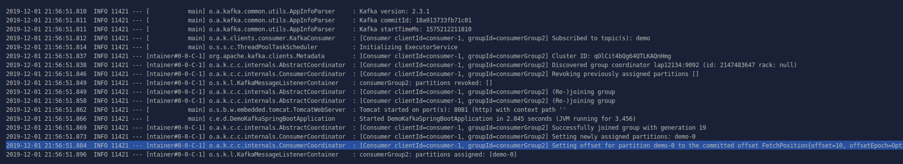
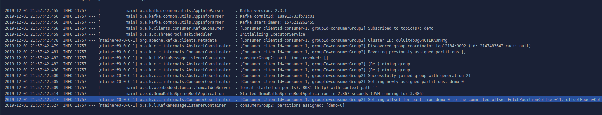
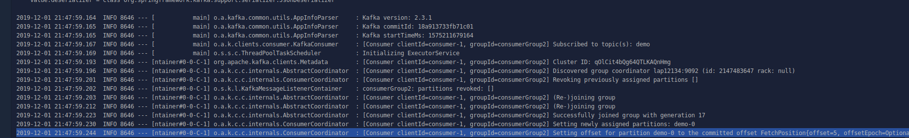
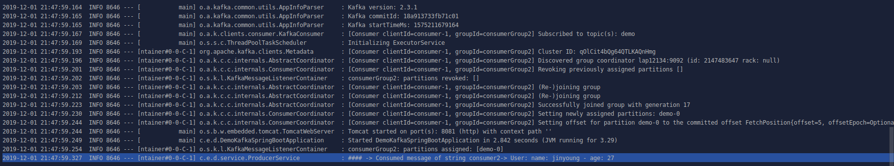

# Auto commit log kafka

Khi consumer read message từ partition, nó báo cho Kafka biết offset của message cuối cùng mà nó cunsume. Offset này được lưu trong 1 topic: _consumer_offsets, nhờ vậy mà consumer có thể stop và restart lại mà không cần phải nhớ những message nào đã được consume

Khi tạo 1 consumer, nó sẽ có default properties sau để giúp thực hiện công việc bên trên:

```
enable.auto.commit
auto.commit.interval.ms
```


- enable.auto.commit default value: true
- auto.commit.interval.ms default value: 5000

Vậy default cứ 5s 1 consumer sẽ commit offset của nó cho Kafka hoặc bất kì khi nào data được fetch từ topic thì nó cũng commit offset cuối cùng.

Tuy nhiên 1 số trường hợp nó sẽ không diễn ra như vậy:
Vd: Khi consumer đang process 1 message ở offset thứ 100 và trong khi xử lí message đó, consumer fetch thêm 1 vài data, offset được commit và consumer bị crash. Sau đó consumer restart lại, sẽ có 2 trường hợp xảy ra:

- Consumer khi đang chưa process xong message thứ 10 thì bị crash 

Nhưng do auto commit đã commit offset với Kafka, nên lúc này offset tiếp theo nhận được là 11, mặc dù message offset thứ 10 chưa xử lí xong sẽ không được gửi lại


- Consumer khi đã process xong message ở offset thứ 5 nhưng bị crash

Khi consumer restart thì kafka gửi lại message đó, data sẽ bị thay đổi do process lại message này



Vậy làm sao để commit offset diễn ra như mong muốn bất kể consumer bị crash?

Ta có thể thực hiện commit offset thử công ngay khi process xong nó.
Thay đổi value của enable.auto.commit property.

```
enable.auto.commit: false
```

Sau đo ta có thể commit offset thủ công ngay sau kho process xong nó và khi consumer bị crash thì nó vẫn có thể fetch được message mong muốn.

