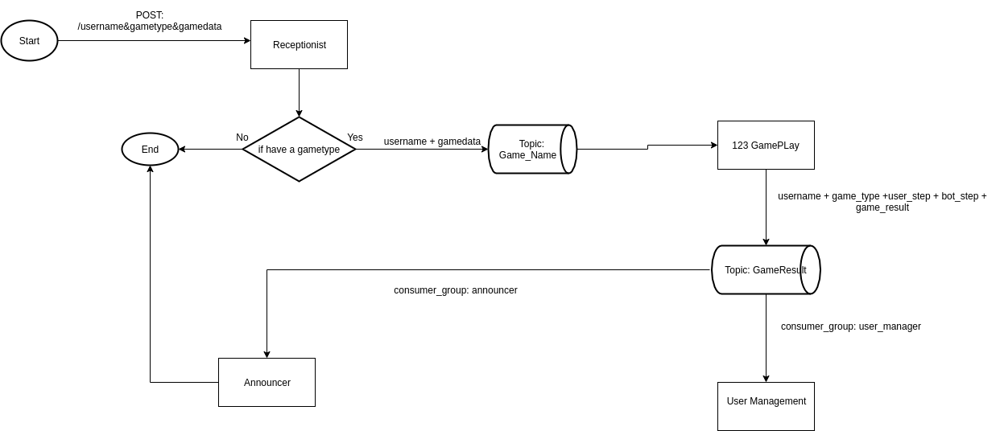
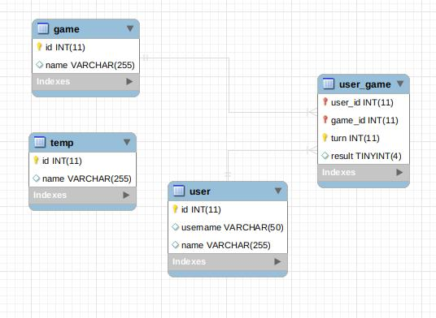

# Document

# 1. Yêu cầu
Deploy 4 service như sau, sử dụng kafka để giao tiếp giữa các service:

Receptionist
 - Đảm nhiệm chức năng tiếp nhận yêu cầu play game.
 - Cung cấp API play 1 game, trong đó cần có các thông tin sau:
  + Loại game.
  + Dữ liệu chơi của loại game đó.
  + Username của người chơi.
 - Validate thông tin input e.g. loại game có hỗ trợ hay không và trả kết quả về cho client.

  Ví dụ đối với trò chơi "Oẳn tù tì" thì input của API bao gồm:
  + Loại game: 123
  + Dữ liệu chơi: Kéo/Búa/Bao
  + Username: huyvha

  

---------------------------------------------------------------------------------------------

User Management
 - Quản lí thông tin và lịch sử chơi game của user (user x chơi game y bao nhiêu lần):
   + username
   + name
   + loại game - lượt chơi
 - Đối với user mới chưa có trong hệ thống thì random username bằng tên của 1 trong các thành viên của team.

---------------------------------------------------------------------------------------------

123 Gameplay
 - Nhận thông tin game và quyết định kết quả của game
 - Ví dụ:
  + Nhận thông tin user chơi "Kéo", random lượt ra của máy và quyết định kết quả game: nếu random ra "Búa" thì kết quả thắng, nếu random ra "Bao" thì kết quả thua, còn lại là hoà. 

---------------------------------------------------------------------------------------------

Announcer
 - Đảm nhiệm việc thông báo kết quả khi game kết thúc
 - Implementation đơn giản chỉ print ra màn hình console kết quả game, bao gồm:
   + thông tin người chơi 
   + thông tin game e.g. tên game, lượt chơi của máy
   + kết quả game

---------------------------------------------------------------------------------------------

Khi thêm 1 game service mới vào hệ thống thì chỉ cần sửa ở service Receptionist, các service còn lại không ảnh hưởng

# 2. Flow chart


# 3. Database


# 4. Configure Kafka
- Start Zookeeper:
```
   ./zkServer.sh start
```
- Start Kafka server:
```
bin/zookeeper-server-start.sh config/zookeeper.properties
```
- Tạo các topic: 123GamePlay, GameResult, GameAnnounce
```
bin/kafka-topics.sh --create --bootstrap-server localhost:9092 --replication-factor 1 --partitions 1 --topic 123GamePlay
```

```
bin/kafka-topics.sh --create --bootstrap-server localhost:9092 --replication-factor 1 --partitions 1 --topic GameResult
```

```
bin/kafka-topics.sh --create --bootstrap-server localhost:9092 --replication-factor 1 --partitions 1 --topic GameAnnounce
```

# 5. API for playgame
- POST: http://localhost:8084/games/1
- Body:
```
{

	"userName":"kaka",
	"gameType":"123GamePlay",
	"userStep":0
}
```