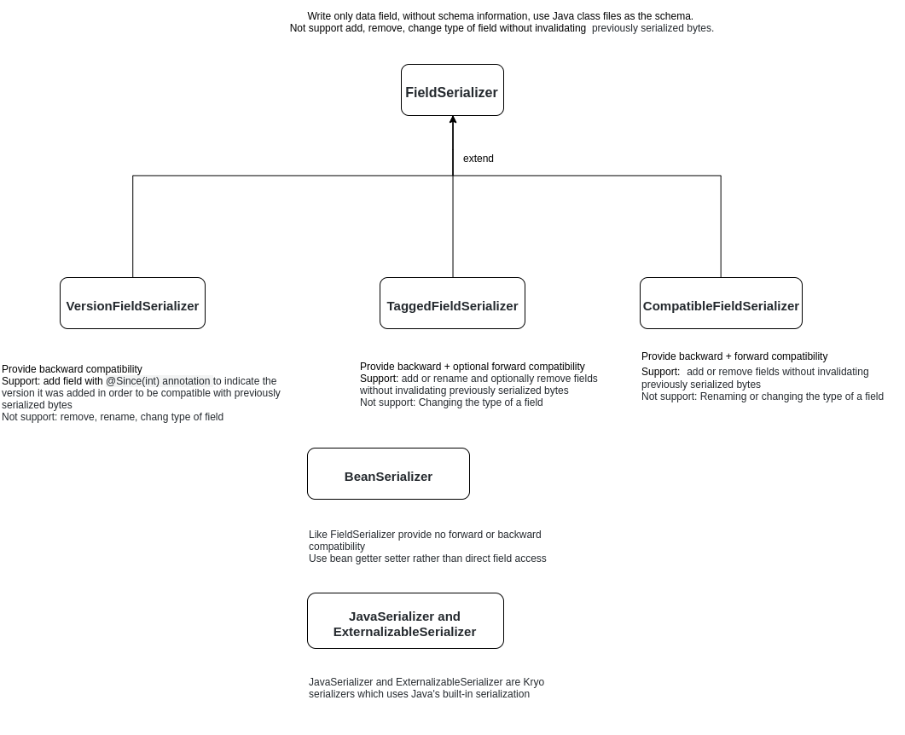

# 11 Compare FstCodec, JsonJacksonCodec, KryoCodec
Đối với 1 số nhu cầu, chẳng hạn như lưu trữ dài hạn các serialized bytes, điều quan trọng là làm thế nào để serialization handle thay đổi cho các class.
- Forward compatibility (reading bytes serialized by newer classes)
- Backward compatibility (reading bytes serialized by older classes)

## 11.1 FSTCodec
### 11.1.1 Compatible

### 11.1.2 Performance

## 11.2 JsonJacksonCodec
### 11.2.1 Compatible
Cung cấp các annotation để add, rename, inject, ignore các property khi deserialization

- Dùng @JsonVersionedModel và @JsonSerializeToVersion annotation
https://github.com/jonpeterson/jackson-module-model-versioning

- Dùng @JsonSerialize và @JsonDeserialize
- Dùng @JsonProperty, @JsonSetter and @JsonGetter để rename property name
- Dùng @JsonIgnore và @JsonIgnoreProperties để ignore các property
- Dùng @JacksonInject để inject 1 value khi deserialization
- Dùng @JsonCreator để define constructor hoặc factory method cho deserialization
  

### 11.2.2 Performance

## 11.3 KryoCodec
### 11.3.1 Compatible
#### Kryo versioning and upgrading
Tuân theo 1 số rule sau:
1. Major version được increase nếu serialization compatibility( khả năng tương thích) bị phá vỡ ( data serialized của version trước sẽ không được deserialized với version mới)
2. Minor version được increase nếu binary hoặc source compatibility của documented public APi bị phá vỡ.

#### Serializers
Kryo cung cấp 1 số serializers với nhiều configuration option và level compatibility.

### 11.3.2 Performance

|               | FstCodec                                                                    | JsonJacksonCodec                                                                                            | KryoCodec                                                                                                                           |
|---------------|-----------------------------------------------------------------------------|-------------------------------------------------------------------------------------------------------------|-------------------------------------------------------------------------------------------------------------------------------------|
| performance   | up to 10 times faster 100% JDK Serialization compatible drop-in replacement |                                                                                                             |                                                                                                                                     |
| compatibility |                                                                             | JsonJackson cung cấp các annotation hỗ trợ add, rename, ignore, inject, order các property khi deserialized | Kryo cung cấp các serializer với các configuration option và level compatibility khác nhau: kể cả backward và forward compatibility |