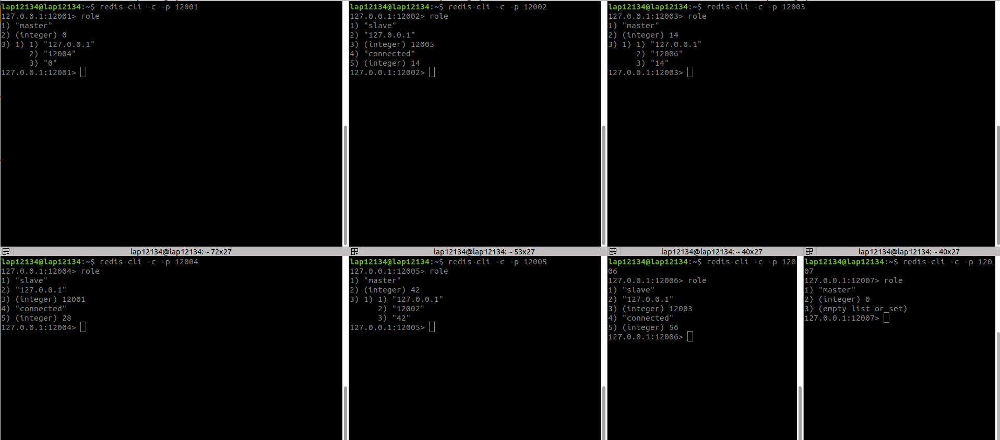
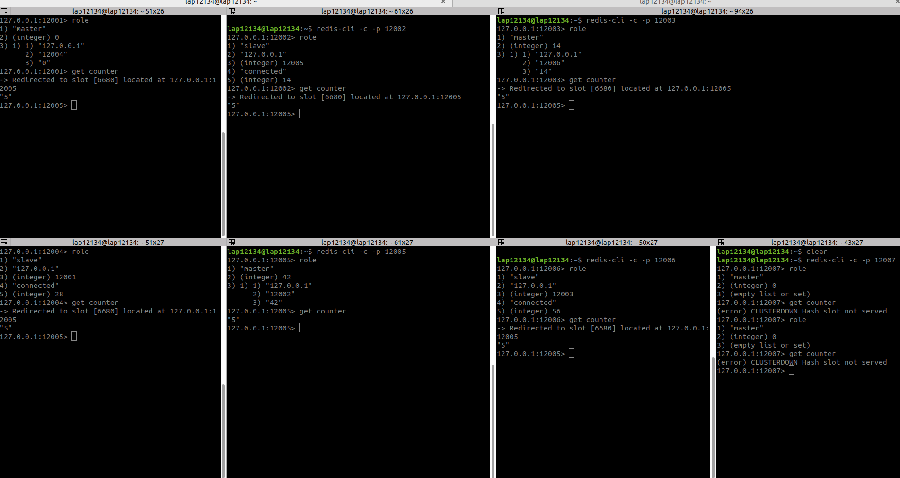
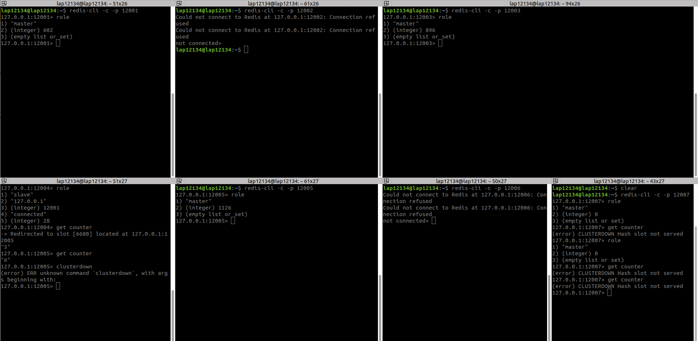
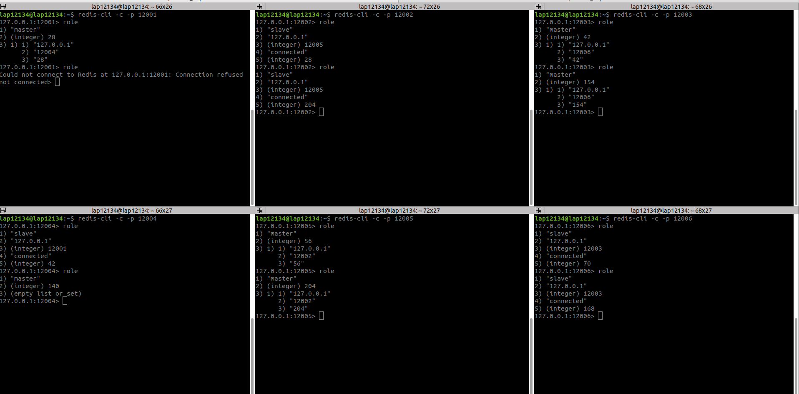
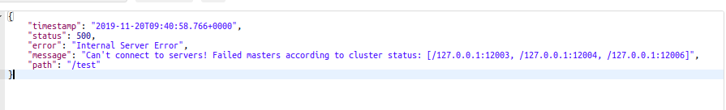

# Test cluster down

# 1. Test down tất cả slave
| Port   |       |       |       |
|--------|-------|-------|-------|
| Master | 12001 | 12003 | 12005 |
| Slave  | 12004 | 12006 | 12002 |

Dừng 6 cluster với 3 cặp Master/Slave như trên


- Khi down 1 slave ở port 12004 của master 12001, app vẫn hoạt động bình thường


- Khi down cả 3 slave, app vẫn hoạt động bình thường
1[](media/cap9.png)

Vậy khi down tất cả slave mà vẫn còn nguyên số master thì app vẫn hoạt động bình thường

# 2. Test down 1 master khi không còn slave nào
Khi down 1 master mà không còn 1 slave nào khi app throws exception


```
org.redisson.client.RedisException: Failed to add master: redis://127.0.0.1:12005 for slot ranges: [[5461-10922]]. Reason - cluster_state:fail
```

# 3. Test slave thăng cấp thành master
- Khi down 1 master 12001 thì slave 12004 của master đó sẽ được thăng cấp lên làm master và các node còn lại không ảnh hưởng


- Khi down hết slave, sau đó down thêm 1 master nữa thì master không còn slave để thăng cấp nên app throws exception như trường hợp 2

# 4. Test down 1 master  khi không còn slave của nó
| Port   |       |       |       |
|--------|-------|-------|-------|
| Master | 12004 | 12005 | 12006 |
| Slave  | 12001 | 12002 | 12003 |

- Khi down 2 master 12004 và 12006 thì các slave 12001 và 12003 của chúng sẽ được thăng cấp làm master


- Khi đó node master 12003 thành master và không có slave nào của nó, chỉ còn 1 slave duy nhất là 12002 của master 12005. Khi down node master 12003 này, app throwns exception


```
org.redisson.client.RedisException: Failed to add master: redis://127.0.0.1:12005 for slot ranges: [[5461-10922]]. Reason - cluster_state:fail
```

message


# Conclusion
Vậy:
- Khi down 1 node master mà vẫn còn node slave của nó thì slave sẽ được thăng cấp lên làm master
- Khi down 1 node master mà không còn node slave nào của nó app sẽ throwns exception và crash