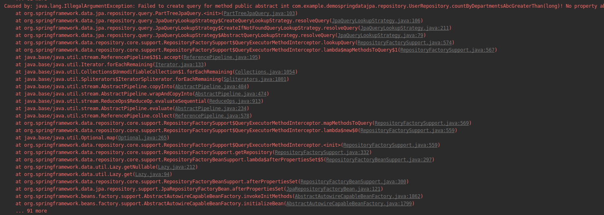
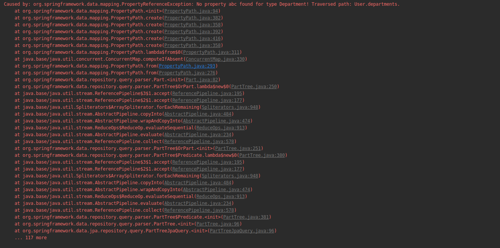

# Spring data JPA

# 1. What is spring data JPA?
Spring data là 1 phần của Spring framework. Mục tiêu của Spring data repository abstraction là giảm thiểu đáng kể số lượng code thắt cổ chai được yêu cầu để implement data access layers cho các persistence store khác nhau

Spring data JPA không phải là 1 JPA provider. Nó là 1 library/ framework, thêm 1 abstract layer lên top của JPA provider. Nếu dùng Spring data JPA, repository layer của application sẽ gồm 3 layer như sau:


- `Spring data JPA` hỗ trợ để tạo JPA repositories bằng cách extend Spring data repository interface
- `Spring data commons` cũng cấp 1 cơ sở hạ tầng được share bởi datastore-specific Spring data projects
- `JPA provider` (vd như Hibernate): implement JPA 

| Hibernate               | Spring data JPA                                                                                                                                                                                                                                                          |
|-------------------------|--------------------------------------------------------------------------------------------------------------------------------------------------------------------------------------------------------------------------------------------------------------------------|
| là 1 JPA implementation | là 1 JPA data access abstraction Không phải là 1 implementation hay JPA provider,  chỉ là 1 abstraction để giảm lượng code thắt cổ chai để implement data access layer cho các persistence store khác nhau  Luôn cần phải có JPA provider như Hibernate hay Eclipse Link |


## 1.1 Dependencies
```
<dependencies>
  <dependency>
    <groupId>org.springframework.data</groupId>
    <artifactId>spring-data-jpa</artifactId>
  </dependency>
<dependencies>
```

## 1.2 Spring data jpa features
- Hỗ trợ build các repository dựa trên `Spring` và `JPA`
- Hỗ trợ Querydsl nên là type-safe JPA queries
- Kiểm tra rõ ràng domain class
- Pagination support, dynamic query execution, có khả năng tích hợp custom data access code
- Validate @Query annotated queries ở bootstrap time
- Support for XML based entity mapping
- JavaConfig dựa trên repository configuration được đánh dấu bởi `@EnableJpaRepositories.`
  
## 1.3 Spring data commons và Spring data JPA repositories /  interface
Below diagram shows the main interfaces from Spring Data Commons and Spring Data JPA modules.


`Spring data commons` là 1 phần của Spring data project cung cấp shared infrastructure giữa các Spring Data project. Bao gồm các technology neutral repository interface như 1 metadata model cho persisting Java class. Spring Data Commons project cung cấp các interface sau:

- Repository<T, ID extends Serializable> interface
- CrudRepository<T, ID extends Serializable> interface
- PagingAndSortingRepository<T, ID extends Serializable> interface
- QueryDslPredicateExecutor interface

### 1.3.1 The Repository<T, ID extends Serializable> interface
`The Repository<T, ID extends Serializable> interface` là 1 marker interface với 2 mục đích sau:
- Nó captures type của managed entity và type của entity's id
- Giúp Spring container tìm các concrete repository interface trong lúc classpath scanning

source code of the Repository interface

```
package org.springframework.data.repository;

import org.springframework.stereotype.Indexed;

@Indexed
public interface Repository<T, ID> {

}
```

### 1.3.2 The CrudRepository<T, ID extends Serializable> interface
`The CrudRepository<T, ID extends Serializable> interface` cung cấp CRUD operator để quản lý các entity

Let's look at the methods/APIs that the CrudRepository interface provides:

```
package org.springframework.data.repository;

import java.util.Optional;

@NoRepositoryBean
public interface CrudRepository < T, ID > extends Repository < T, ID > {

    <S extends T > S save(S entity);

    <S extends T > Iterable < S > saveAll(Iterable < S > entities);

    Optional < T > findById(ID id);

    boolean existsById(ID id);

    Iterable < T > findAll();

    Iterable < T > findAllById(Iterable < ID > ids);

    long count();

    void deleteById(ID id);

    void delete(T entity);

    void deleteAll();
}
```

- long count() - Returns the number of entities available.
- void delete(T entity) - Deletes a given entity.
- void deleteAll() - Deletes all entities managed by the repository.
- void deleteAll(Iterable<? extends T> entities) - Deletes the given entities.
- void deleteById(ID id) - Deletes the entity with the given id.
- boolean existsById(ID id) - Returns whether an entity with the given id exists.
- Iterable findAll() - Returns all instances of the type.
- Iterable findAllById(Iterable ids) - Returns all instances of the type with the given IDs.
- Optional findById(ID id) - Retrieves an entity by its id.
- save(S entity) - Saves a given entity.
- Iterable saveAll(Iterable entities) - Saves all given entities.

CRUD methods của `CrudRepository` đều là transactional by default. Các method này sẽ được annotated với @Transactional annotation với default setting trong implementation class lúc runtime. Ta không cần tự tạo implementation class vì Spring sẽ auto create chúng lúc runtime.


### 1.3.3 The PagingAndSortingRepository<T, ID extends Serializable> interface
`The PagingAndSortingRepository<T, ID extends Serializable> interface` là extension của `CrudRepository` cung cấp thêm 1 số method để retrieve entities thông qua pagination và sorting abstraction

Let's look at the methods/APIs that the PagingAndSortingRepository interface provides:

```
package org.springframework.data.repository;

import org.springframework.data.domain.Page;
import org.springframework.data.domain.Pageable;
import org.springframework.data.domain.Sort;

@NoRepositoryBean
public interface PagingAndSortingRepository < T, ID > extends CrudRepository < T, ID > {

    /**
     * Returns all entities sorted by the given options.
     * 
     * @param sort
     * @return all entities sorted by the given options
     */
    Iterable < T > findAll(Sort sort);

    /**
     * Returns a {@link Page} of entities meeting the paging restriction provided in the {@code Pageable} object.
     * 
     * @param pageable
     * @return a page of entities
     */
    Page < T > findAll(Pageable pageable);
}
```

### 1.3.4 The QueryDslPredicateExecutor interface
`The QueryDslPredicateExecutor interface` không phải là 1 repostiory interface. Nó declares các method dùng để retrieve các entities từ db bằng cách dùng `QueryDsl` predicate object

Let's look at the methods/APIs that the QueryDslPredicateExecutor interface provides:

```
package org.springframework.data.querydsl;

import java.util.Optional;

import org.springframework.data.domain.Page;
import org.springframework.data.domain.Pageable;
import org.springframework.data.domain.Sort;

import com.querydsl.core.types.OrderSpecifier;
import com.querydsl.core.types.Predicate;

public interface QuerydslPredicateExecutor < T > {

    Optional < T > findOne(Predicate predicate);

    Iterable < T > findAll(Predicate predicate);

    Iterable < T > findAll(Predicate predicate, Sort sort);

    Iterable < T > findAll(Predicate predicate, OrderSpecifier << ? > ...orders);

    Iterable < T > findAll(OrderSpecifier << ? > ...orders);

    Page < T > findAll(Predicate predicate, Pageable pageable);

    long count(Predicate predicate);

    boolean exists(Predicate predicate);
}
```

## 1.4 Spring Data JPA Interfaces
Spring Data JPA module support JPA based data access layer, cung cấp các interface sau:
- JpaRepository<T, ID extends Serializable> interface
- JpaSpecificationExecutor interface

### 1.4.1 JpaRepository<T, ID extends Serializable> interface
`JpaRepository<T, ID extends Serializable> interface` interface là 1 JPA specific repository interface combine các method được declared bởi common repository interface phía sau 1 single interface

Let's look at the methods/APIs that the JpaRepository interface provides:

```
package org.springframework.data.jpa.repository;

import java.util.List;

import javax.persistence.EntityManager;

import org.springframework.data.domain.Example;
import org.springframework.data.domain.Sort;
import org.springframework.data.repository.NoRepositoryBean;
import org.springframework.data.repository.PagingAndSortingRepository;
import org.springframework.data.repository.query.QueryByExampleExecutor;

@NoRepositoryBean
public interface JpaRepository < T, ID > extends PagingAndSortingRepository < T, ID > , QueryByExampleExecutor < T > {

    List < T > findAll();

    List < T > findAll(Sort sort);

    List < T > findAllById(Iterable < ID > ids);

    <S extends T > List < S > saveAll(Iterable < S > entities);

    void flush();

    <S extends T > S saveAndFlush(S entity);

    void deleteInBatch(Iterable < T > entities);

    void deleteAllInBatch();

    T getOne(ID id);

    @Override <
    S extends T > List < S > findAll(Example < S > example);

    @Override <
    S extends T > List < S > findAll(Example < S > example, Sort sort);
}
```

### 1.4.2 JpaSpecificationExecutor interface
`JpaSpecificationExecutor interface` không phải là 1 repository interface, nó declares các method dùng để retrieve các entity từ db thông qua Specification object dùng JPA criteria API

Let's look at the methods/APIs that the JpaSpecificationExecutor interface provides:

```
package org.springframework.data.jpa.repository;

import java.util.List;
import java.util.Optional;

import org.springframework.data.domain.Page;
import org.springframework.data.domain.Pageable;
import org.springframework.data.domain.Sort;
import org.springframework.data.jpa.domain.Specification;
import org.springframework.lang.Nullable;

public interface JpaSpecificationExecutor<T> {

 Optional<T> findOne(@Nullable Specification<T> spec);

 List<T> findAll(@Nullable Specification<T> spec);

 Page<T> findAll(@Nullable Specification<T> spec, Pageable pageable);

 List<T> findAll(@Nullable Specification<T> spec, Sort sort);

 long count(@Nullable Specification<T> spec);
}
```

# 2. How to use Spring data JPA interface
3 bước để dùng `Spring Data JPA` repositories/interfaces

1. Tạo 1 repository interface và extend 1 trong những repository interface của Spring data

```
public interface CustomerRepository extends CrudRepository<Customer, Long> {

}
```

2. Thêm các custom query method vào repository interface đã tạo ở trên nếu cần
```
public interface CustomerRepository extends CrudRepository<Customer, Long> {

    long deleteByLastname(String lastname);

    List<User> removeByLastname(String lastname);

    long countByLastname(String lastname);
}
```

3. Set up Spring để tạo proxy instance cho các interface trên, dùng `JavaConfig` hoặc XML configuration
- Dùng Java configuration:
   ```
   import org.springframework.data.jpa.repository.config.EnableJpaRepositories;

   @EnableJpaRepositories
   public class Config {}
   ```

- Dùng XML configuration, define 1 bean nhu sau:
   ```
   <?xml version="1.0" encoding="UTF-8"?>
   <beans xmlns="http://www.springframework.org/schema/beans"
      xmlns:xsi="http://www.w3.org/2001/XMLSchema-instance"
      xmlns:jpa="http://www.springframework.org/schema/data/jpa"
      xsi:schemaLocation="http://www.springframework.org/schema/beans
      http://www.springframework.org/schema/beans/spring-beans.xsd
      http://www.springframework.org/schema/data/jpa
      http://www.springframework.org/schema/data/jpa/spring-jpa.xsd">

      <jpa:repositories base-package="com.acme.repositories"/>

   </beans>
   ```

4. Inject repository interface vào các component khác và dùng implementation được cung cấp tự động bởi Spring
   
```
@Service
public class CustomerServiceImpl implements CustomerService {

    @Autowired
    private CustomerRepository customerRepository;

    @Override
    @Transactional
    public List < Customer > getCustomers() {
        return customerRepository.findAll();
    }

    @Override
    @Transactional
    public void saveCustomer(Customer theCustomer) {
        customerRepository.save(theCustomer);
    }

    @Override
    @Transactional
    public Customer getCustomer(int id) throws ResourceNotFoundException {
        return customerRepository.findById(id).orElseThrow(
            () - > new ResourceNotFoundException(id));
    }

    @Override
    @Transactional
    public void deleteCustomer(int theId) {
        customerRepository.deleteById(theId);
    }
}
```

link: https://www.javaguides.net/2018/11/spring-data-jpa-tutorial-getting-started.html

# 3. Query creation from method names
Spring Data JPA cung cấp nhiều cách để tạo câu query, trong đó có tạo query từ method name strategy

vd:
```
public interface UserRepository extends Repository<User, Long> {
  List<User> findByEmailAddressAndLastname(String emailAddress, String lastname);
}
```

`Spring Data JPA` create 1 query bằng cách dùng JPA creteria API, nhưng bản chất nó vẫn là câu query như sau: `select u from User u where u.emailAddress = ?1 and u.lastname = ?2.`

## 3.1 Supported keywords inside method names


## 3.2 Rules for creating query methods
- Tên của query method phải bắt đầu bởi các tiền tố: `find...By, read...By, query...By, count...By, get...By`
- Nếu muốn limit số returned query results, có thể thêm `First` `Top` trước `By`.
  vd: `findFirstBy`, `findTopBy`, `findFirst1By`, `findTop1By`
- Nếu muốn select unique results, thêm `Distinct` vào trước `By`. vd: `findTitleDistinctBy` hoặc `findDistinctTitleBy`
- Phải thêm search criteria của query method ngay sau `By`. Có thể chỉ định search criteria bằng cách kết hợp các property expression với các supported keywords
- Nếu query method chỉ định n search conditions, ta phải thêm n method parameter cho nó. Số method paramenter phải bằng với số seach condition với cùng 1 thứ tự
- Phải set return type cho query method theo rule dưới đây

## 3.3 Rule for return values from query method
1. Nếu câu query chỉ return 1 result, có thể return theo những type sau:
   - Basic type: return found basic type hoặc null
   - Entiy: return 1 entity object hoặc null
   - Guava / Java 8 Optional<T>: return 1 Optional bao gồm found object hoặc empty Optional

Vd:
```
import java.util.Optional;
import org.springframework.data.jpa.repository.Query;
import org.springframework.data.repository.Repository;
import org.springframework.data.repository.query.Param;
 
interface TodoRepository extends Repository<Todo, Long> { 
 
    @Query("SELECT t.title FROM Todo t where t.id = :id") 
    String findTitleById(@Param("id") Long id);
     
    @Query("SELECT t.title FROM Todo t where t.id = :id") 
    Optional<String> findTitleById(@Param("id") Long id);
 
    Todo findById(Long id);
     
    Optional<Todo> findById(Long id);
}
```

2. Nếu query return nhiều hơn 1 result:
   - List<T>: return 1 list bao gồm các query results hoặc empty list
   - Stream<T>: return 1 stream dùng để access query results hoặc empty Stream

vd:
```
import java.util.stream.Stream;
import org.springframework.data.repository.Repository;
 
interface TodoRepository extends Repository<Todo, Long> { 
 
    List<Todo> findByTitle(String title);
     
    Stream<Todo> findByTitle(String title);
}
```

3. Nếu muốn query method được executed asynchronously, thêm @Async và return 1 Future<T> object
vd:

```
import java.util.concurrent.Future;
import java.util.stream.Stream;
import org.springframework.data.jpa.repository.Query;
import org.springframework.data.repository.Repository;
import org.springframework.data.repository.query.Param;
import org.springframework.scheduling.annotation.Async;
 
interface TodoRepository extends Repository<Todo, Long> { 
 
    @Async
    @Query("SELECT t.title FROM Todo t where t.id = :id") 
    Future<String> findTitleById(@Param("id") Long id);
     
    @Async
    @Query("SELECT t.title FROM Todo t where t.id = :id") 
    Future<Optional<String>> findTitleById(@Param("id") Long id);
 
    @Async
    Future<Todo> findById(Long id);
     
    @Async
    Future<Optional<Todo>> findById(Long id);
 
    @Async
    Future<List<Todo>> findByTitle(String title);
     
    @Async
    Future<Stream<Todo>> findByTitle(String title);
}
```

## 3.4 Passing method parameters to query methods when use @Query 
Có thể pass các parameter cho db queries bằng cách pass method parameter cho query methods. Spring data JPA support cả position based parameters binding và named parameters.

### 3.4.1 Position based parameter binding
***Position based parameter binding*** nghĩa là thứ tự các method parameter quyết định xem placeholder nào sẽ được replace bởi nó. Vd như placeholder thứ nhất sẽ được replace bởi method parameter thứ nhất, ...
vd:
```
import java.util.Optional
import org.springframework.data.jpa.repository.Query;
import org.springframework.data.repository.Repository;
 
 
interface TodoRepository extends Repository<Todo, Long> { 
 
    public Optional<Todo> findByTitleAndDescription(String title, String description);
     
    @Query("SELECT t FROM Todo t where t.title = ?1 AND t.description = ?2")
    public Optional<Todo> findByTitleAndDescription(String title, String description);
     
    @Query(value = "SELECT * FROM todos t where t.title = ?0 AND t.description = ?1", 
        nativeQuery=true
    )
    public Optional<Todo> findByTitleAndDescription(String title, String description);
}
```

Cách này dễ bị các lỗi nhỏ vì ta không thể thay đổi thứ tự các method parameters hoặc thứ tự của các placeholder mà vẫn giữ nguyên câu query db được. Giải pháp cho vấn đề này là sử dụng named parameters

### 3.4.2 Named parameters
Dùng named parameters bằng cách replace 1 số placeholder tìm được từ db queries với concrete parameter name, và annotating các method parameter @Param annotation

@Param annotation configure name của named parameter được replaced bởi giá trị của method parameter

vd:
```
import java.util.Optional
import org.springframework.data.jpa.repository.Query;
import org.springframework.data.repository.Repository;
import org.springframework.data.repository.query.Param;
 
 
interface TodoRepository extends Repository<Todo, Long> { 
     
    @Query("SELECT t FROM Todo t where t.title = :title AND t.description = :description")
    public Optional<Todo> findByTitleAndDescription(@Param("title") String title, 
                                                    @Param("description") String description);
     
    @Query(
        value = "SELECT * FROM todos t where t.title = :title AND t.description = :description", 
        nativeQuery=true
    )
    public Optional<Todo> findByTitleAndDescription(@Param("title") String title, 
                                                    @Param("description") String description);
}
```

link: https://www.petrikainulainen.net/programming/spring-framework/spring-data-jpa-tutorial-introduction-to-query-methods/

# 4. QueryDSL
## 4.1 Type safe queries
Các custom queries thì rất mạnh nhưng cũng rất nguy hiểm vì nó không type safe. Khi refactor các domain class, vd như: rename firstname thành name, mỗi câu query liên quan đến property này đều bị rảnh hưởng và ta sẽ không biết được lỗi này cho đến khi runtime. Để làm cho các câu query trở nên type safe, ta có thể tìm ra lỗi query lúc compile time, kết quả sẽ giảm số bug về sau

JPA 2.0 define type-safe queries bằng cách dùng CriteriaQuery API, như sau:

```
LocalDate today = new LocalDate();

CriteriaBuilder builder = em.getCriteriaBuilder();
CriteriaQuery<Customer> query = builder.createQuery(Customer.class);
Root<Customer> root = query.from(Customer.class);

Predicate hasBirthday = builder.equal(root.get(Customer_.birthday), today);
Predicate isLongTermCustomer = builder.lessThan(root.get(Customer_.createdAt), today.minusYears(2);
query.where(builder.and(hasBirthday, isLongTermCustomer));
em.createQuery(query.select(root)).getResultList();
```

Criteria queries cho phép tạo type-safe queries nhưng khá dài dòng

## 4.2 QueryDSL

```
LocalDate today = new LocalDate();

QCustomer customer = QCustomer.customer;
BooleanExpression hasBirthday = customer.birthday.eq(today);
BooleanExpression isLongTermCustomer = customer.createdAt.lt(today.minusYears(2));
new JPAQuery(em)
 .from(customer)
 .where(hasBirthday.and(isLongTermCustomer))
 .list(customer);
```

Khi dùng QueryDSL ta giảm thiểu được số lượng code và component. Khi mà JPA cần có CriteriaQuery, CriteriaBulder và Root, ta có thể tạo query selection criteria trực tiếp thông qua generated meta model(vd QCustomer). Vì selection crieria (BooleanExpression) không gắn trực tiếp vào query instance như JPA nên có thể reuse expressions này ở các câu query khác nhau.

Ta có thể tạo 1 catalog class với các common expression:
```
class CustomerExpressions {
 public static BooleanExpression hasBirthday() {
  LocalDate today = new LocalDate();
  return QCustomer.customer.birthday.eq(today);
 }
 public static BooleanExpression isLongTermCustomer() {
  LocalDate today = new LocalDate();
  return QCustomer.customer.createdAt.lt(today.minusYears(2));
 }
}
```

và dùng trực tiếp các expression này trong repository implmentation

## 4.3 QueryDSL + Spring Data JPA
Spring cung cấp full QueryDSL intergration là `QueryDslPredicateExecutor` interface. Khi extend repository interface với `QueryDslPredicateExecutor` interface, sẽ có được các powerful query method sau:

```
T findOne(Predicate predicate);
Iterable<T> findAll(Predicate predicate);
Iterable<T> findAll(Predicate predicate, OrderSpecifier<?>... orders);
Page<T> findAll(Predicate predicate, Pageable pageable);
long count(Predicate predicate);
```

Cho phép các expression extend từ Predicate trong repository:
```
public void sendGifts() {
 Predicate shouldRecieveGiftToday = hasBirthday().and(isLongTermCustomer());
 for(Customer customer: customerRepository.findAll(shouldRecieveGiftToday)) {
  giftSender.sendGiftTo(customer);
 }
}
```

# How to parse
https://docs.spring.io/spring-data/data-jpa/docs/current/api/org/springframework/data/jpa/repository/query/PartTreeJpaQuery.html





