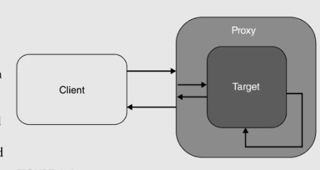
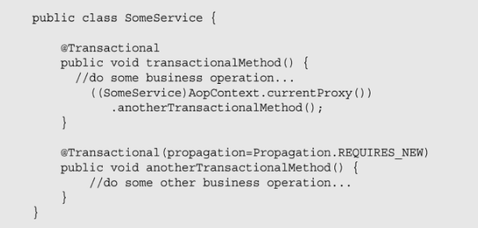

# Answer question
- What is Global/Local Transaction?
- What is PlatformTransactionManager and its responsibilities?
- What is declarative transaction management?
- Execution flow of any method annotated with @Transactional (or how does @Transactional work)?
- What are @Transactional settings?
- By default, when will the transacation rollback?
- What are the values of Transaction Propagation? Example?
- Can we annotate private/protected methods with @Transactional? Do those methods get transactional behavior?
- Does @Transactional work with self-invocation?

## 1. What's global/local transaction
| Global transaction                                                                                                                                                                                                                                                    | Local transaction                                                                                                                      |
|-----------------------------------------------------------------------------------------------------------------------------------------------------------------------------------------------------------------------------------------------------------------------|----------------------------------------------------------------------------------------------------------------------------------------|
| Có thể là nhiều application, nơi mà các transaction được thực hiện trên các db khác nhau. Đó gọi là distributed transaction processing                                                                                                                                | Local transaction diễn ra trong 1 application hoặc 1 RDBMS, như JDBC connection Tất cả transaction code đều nằm bên trong code         |
| Transaction manager không thể ở handle nó trong 1 application, mà nó phải nằm ở application server level JTA (Java transaction API) cần JNDI hỗ trợ tìm kiếm trên các db khác nhau,  và transaction manager sẽ quyết định commit hay rollback distributed transaction | Không có application server, không thể đảm bảo tính đúng đắn giữa multiple resource nên không thể làm việc trên multiple resource được |

## 2. What is PlatformTransactionManager and its reponsibilities?

Mỗi công nghệ data access đều có 1 cơ chế transaction riêng: các API khác nhau để start, commit... transaction. Đó gọi là transaction demarcation (phân định các transaction). Nhiệm vụ của Spring là cung cấp 1 abtract và 1 API chuẩn cho các demarcate transaction cả programmatically và declaratively. GIúp cho hệ thống độc lập với công nghệ truy cập data bên dưới và có thể switch giữa các db khác nhau.

Spring's transaction abstraction model dựa trên PlatformTransactionManager interface. Nhiệm vụ của dev là quyết định xem PlatformTransactionManager implementation nào sẽ được dùng bơi Spring container. 
PlatformTransactionManager API giúp bảo mật và tách biệt code với công nghệ truy cập data, nên có thể mix nhiều loại công nghệ truy cập data trong cùng 1 transaction. Khi cần thay đổi công nghệ truy cập data chỉ cần thay đổi bean definition của transactionManager. 


Interface PlatformTransactionManager

```
public interface PlatformTransactionManager {

  TransactionStatus getTransaction(TransactionDefinition definition)
    throws TransactionException;

  void commit(TransactionStatus status) throws TransactionException;

  void rollback(TransactionStatus status) throws TransactionException;
}
```

link: https://books.google.com.vn/books?id=VfEwBgAAQBAJ&pg=PA180&lpg=PA180&dq=PlatformTransactionManager+responsibilities&source=bl&ots=fslUxEP1kn&sig=ACfU3U1SyMHlXdUNpqR5w9Lnwv0G80ZvoA&hl=vi&sa=X&ved=2ahUKEwiC--KzwK3lAhVO_GEKHfncDvoQ6AEwC3oECAoQAQ#v=onepage&q=PlatformTransactionManager%20responsibilities&f=false

## 3. What is declarative transaction management?
- **Programmatic transaction management**: nghĩa là bạn phải quản lí transaction bằng cách lập trình, nó sẽ linh hoạt hơn nhưng khó để maintain
- **Declarative transaction management**: nghĩa là bạn phân chia việc quản lí transaction từ business code. Bản chỉ cần dùng annotation hoặc XML-based configuration để quản lí các transaction


## 4. Execution flow of any method annotated with @Transactional (or how does @Transactional work)?
@EnableTransactionManagement annotation activate annotation-based declarative transaction managemnet. Spring container scans các class bean được quản lí có @transactional annotation. Khi annotation được tìm thấy, nó tạo 1 proxy wrap instance bean lại, thế nên proxy instance sẽ trở thành 1 bean và được deliver bời Spring container khi được requested

Khi call 1 method trong bean, thì đầu tiên proxy instance intercept call đó và kiểm tra xem liệu transaction nên được start không, nếu có thì begin transacion. Sau đó nó sẽ call tới method trong target bean và execute business logic. Khi method của target bean return, proxy commit transaction và return nó.

Mặt khác, khi 1 exception được thrown ra từ bên trong transaction method, Spring check exception type để quyết định xem transaction sẽ commit hay rollback. Mặc định thì, java.lang.RuntimeException và exception kế thừa từ đó sẽ gây transaction rollback: system hay uncked exception. Tuy nhiên java.lang.Exception và các exception kế thừa từ đó sẽ gây commit: application hay checked exception.


## 5. What are @Transactional settings?
Default `@Transactional` Settings:
- propagation setting: `PROPAGATION_REQUIRED`
- isolation level: `ISOLATION_DEFAULT`
- transaction là read-write
- transaction timeout default là default timeout của hệ thống transaction cơ bản hoặc không có nếu timeout không được support
- bất kì `RuntimeException` đều rollback và bất kì checked `Exception` thì không

Có thể thay đổi default setting theo bảng như sau:

| Property               | Type                                                               | Description                                                                                     |
|------------------------|--------------------------------------------------------------------|-------------------------------------------------------------------------------------------------|
| value                  | String                                                             | Optional qualifier that specifies the transaction manager to be used.                           |
| propagation            | enum: Propagation                                                  | Optional propagation setting.                                                                   |
| isolation              | enum: Isolation                                                    | Optional isolation level. Applies only to propagation values of REQUIRED or REQUIRES_NEW.       |
| timeout                | int (in seconds of granularity)                                    | Optional transaction timeout. Applies only to propagation values of REQUIRED or REQUIRES_NEW.   |
| readOnly               | boolean                                                            | Read-write versus read-only transaction. Only applicable to values of REQUIRED or REQUIRES_NEW. |
| rollbackFor            | Array of Class objects, which must be derived from Throwable.      | Optional array of exception classes that must cause rollback.                                   |
| rollbackForClassName   | Array of class names. The classes must be derived from Throwable.  | Optional array of names of exception classes that must cause rollback.                          |
| noRollbackFor          | Array of Class objects, which must be derived from Throwable.      | Optional array of exception classes that must not cause rollback.                               |
| noRollbackForClassName | Array of String class names, which must be derived from Throwable. | Optional array of names of exception classes that must not cause rollback.                      |


## 6. By default, when will the transacation rollback?
Mặt khác, khi 1 exception được thrown ra từ bên trong transaction method, Spring check exception type để quyết định xem transaction sẽ commit hay rollback. Mặc định thì, java.lang.RuntimeException và exception kế thừa từ đó sẽ gây transaction rollback: system hay uncked exception. Tuy nhiên java.lang.Exception và các exception kế thừa từ đó sẽ gây commit: application hay checked exception.

## 7. What are the values of Transaction Propagation? Example?
Transaction propagation gồm 6 loại:
- REQUIRED
- SUPPORTS
- NOT_SUPPORTED
- REQUIRES_NEW
- NEVER
- MANDATORY

### 7.1 REQUIRED (Default Transaction Propagation)

`REQUIRED` nếu chưa có transaction nào thì sẽ tạo 1 transaction mới, nếu đã có thì thực hiện công việc trên transaction sẵn có. Vì thế commit hay rollback của inner và outer transaction đều bị ảnh hướng bởi nhau

Vd: 

Output:
EmployeeService called using OrganizationService:


EmployeeService called directly:


### 7.2 Transaction Propagation —  REQUIRES_NEW
Khác với `REQUIRED`, `REQUIRES_NEW` luôn tạo 1 transaction mới kể cả có tồn tại transaction cũ hay không. Vì thế commit hay rollback của inner và outer transaction phù thuộc vào cách handle các exception bên trong nó.

Vd: 


Output:
 EmployeeService called using OrganizationService:


 EmployeeService called directly:


Đây là 2 loại propagation thường dùng, 4 loại còn lại tham khảo thêm trong link sau:
https://dzone.com/articles/spring-boot-transactions-tutorial-understanding-tr


## 8. Can we annotate private/protected methods with @Transactional? Do those methods get transactional behavior?


According to the Spring documentation:
“When using proxies, you should apply the @Transactional annotation only to methods with public visibility. If you do annotate protected, private or package-visible methods with the @Transactional annotation, no error is raised, but the annotated method does not exhibit the configured transactional settings. Consider the use of AspectJ (see below) if you need to annotate non-public methods.”

## 9. Does @Transactional work with self-invocation?
According to the Spring documentation:
“In proxy mode (which is the default), only external method calls coming in through the proxy are intercepted. This means that self-invocation, in effect, a method within the target object calling another method of the target object, will not lead to an actual transaction at runtime even if the invoked method is marked with @Transactional. Also, the proxy must be fully initialized to provide the expected behaviour so you should not rely on this feature in your initialization code, i.e. @PostConstruct.”

@Transactional work với self-invocation sẽ không work được. Vì bên trong 1 instance bean, khi 1 transaction method này gọi 1 transaction method khác bên trong chính bean đó, thì method đó sẽ không có những behavior như 1 transaction vì lời gọi này xảy ra bên trong target bean, nó không thông qua proxy nên proxy không thể tạo transaction cho method đó được.

Có 2 cách để thực hiện self-invocation mà vẫn đảm bảo transaction behavior cho method:
- Cách 1: @Autowired chính bean là class đó, sau đó thực hiện gọi hàm như bình thường. Khi @Autowired bean đó thì thực chất là đang autowired proxy bean instance bao quanh bean đó. Ví thế khi gọi method thì vẫn đảm bảo method được gọi là từ bên ngoài xuyên qua proxy và vào tới target bên, nên nó sẽ có transaction behavior
- Cách 2: Lấy currentProxy ra và gọi method thông qua currentProxy đó. Kết quả giống như cách 1
vd:


## 10. Why do we should annotate the DAO with @Repository?
@Repository biến các uncked excepton( được throw từ DAO method) đủ điều kiện translation sang Spring DataAccessException